# Challenge 1 - Code Refactor Starter Code

## Purpose

The purpose of this project was to review an existing code for a website for the client Horiseon and refactor it. The codebase had to follow accessibility standards, and be consolidated and efficient. 

## Built With

## Table of Contents

- [User Story](#user-story)
- [Acceptance Criteria](#acceptance-criteria)
- [Website Link](#website-link)
- [Code Refactor](#code-refactor)
    - [HTML](#html)
    - [CSS](#css)
- [Credits](#credits)

## Challenge - User Story

This a description of the requirements for the website requested by the client:

- AS A marketing agency I WANT a codebase that follows accessibility standards SO THAT our own site is optimized for search engines.

## Challenge - Acceptance Criteria

The following criteria for the codebase of the website had to be met:

GIVEN a webpage meets accessibility standards
- WHEN I view the source code  
  THEN I find semantic HTML elements
- WHEN I view the structure of the HTML elements  
  THEN I find that the elements follow a logical structure independent of styling and positioning
- WHEN I view the image elements  
  THEN I find accessible alt attributes
- WHEN I view the heading attributes  
  THEN they fall in sequential order
- WHEN I view the title element  
  THEN I find a concise, descriptive title

## Website Link and Mock-up

[Horiseon](https://jessoliva.github.io/horiseon/)

## Cloning Repository Procedure
I followed these steps to clone the remote repository with the code base for Challenge 1 onto my local machine and push it to a new remote repository on my github.

- navigate to the main page of the remote repository with the code base
- click on "Code"
- select ssh and copy ssh url
- open terminal and change the current working directory to the location where you want to save the cloned remote repository
- input: git clone <sshurl>
- press enter and remote repository is cloned onto the selected working directory
- create a repository in your github - repository name = horiseon
- go to terminal and make sure you're in correct directory with the cloned repository
- input: git remote -v --> to see remote links
- input: git remote remove origin --> to remove existing remote 
- input: git remote add origin <newurlgoeshere> --> to link your github repository ssh url
- input: git push origin main --> to push onto desired remote repository

## Code Refactor
### HTML Edits
I made the following edits to the HTML code:

#### Within &lt;head&gt;
- changed &lt;title&gt;website&lt;/title&gt; to &lt;title&gt;Horiseon&lt;/title&gt;

#### Header Section
- changed &lt;div class="header"&gt; to &lt;header&gt;
- changed &lt;div&gt; to &lt;nav&gt;

#### Hero section
- changed &lt;div&gt; to &lt;section&gt;

#### Content section
- changed &lt;div class="content"&gt; to &lt;section class="content"&gt;

#### Search Engine Optimization Section
- changed  
&lt;div class="search-engine-optimization"&gt; to  
&lt;article id="search-engine-optimization"&gt;
    - changed &lt;div&gt; to &lt;article&gt;
    - removed class="search-engine-optimization"
    - added id="search-engine-optimization"
- changed &lt;img src="./assets/images/search-engine-optimization.jpg" class="float-left" /&gt; to &lt;img src="./assets/images/search-engine-optimization.jpg" alt="notebook page displaying factors that affect search engine optimization" class="float-left" /&gt;
    - added alt=" " attribute

#### Online Reputation Section
- changed   
&lt;div id="online-reputation-management" class="online-reputation-management"&gt; to  
&lt;article id="online-reputation-management"&gt;
    - changed &lt;div&gt; to &lt;article&gt;
    - removed class="online-reputation-management"
- changed  
&lt;img src="./assets/images/social-media-marketing.jpg" class="float-left" /&gt; to   
&lt;img src="./assets/images/online-reputation-management.jpg" alt="laptop with presentation on screen showing slide displaying improving reputation"  class="float-right" /&gt;
    - added alt=" " attribute

#### Social Media Marketing Section
- changed  
&lt;div id="social-media-marketing" class="social-media-marketing"&gt; to  
&lt;article id="social-media-marketing"&gt;
    - changed &lt;div&gt; to &lt;article&gt;
    - removed class="social-media-marketing"
- changed  
&lt;img src="./assets/images/social-media-marketing.jpg" class="float-left" /&gt; to  
&lt;img src="./assets/images/social-media-marketing.jpg" alt="image displaying icons that represent factors that affect social media marketing" class="float-left" /&gt;
    - added alt=" " attribute

#### Benefits Section
- changed &lt;div class="benefits"&gt; to &lt;section class="benefits"&gt;

#### Lead Generation Section
- changed &lt;div class="benefit-lead"&gt; to &lt;div&gt;
    - deleted class
- changed  
&lt;img src="./assets/images/lead-generation.png" /&gt; to  
&lt;img src="./assets/images/brand-awareness.png" alt="" /&gt;
    - added alt="" attribute

#### Brand Awareness Section
- changed &lt;div class="benefit-awareness"&gt; to &lt;div&gt;
    - deleted class
- changed  
&lt;img src="./assets/images/brand-awareness.png" /&gt; to  
&lt;img src="./assets/images/brand-awareness.png" alt="" /&gt;
    - added alt="" attribute

#### Cost Management Section
- changed &lt;div class="benefit-cost"&gt; to &lt;div&gt;
    - deleted class
- changed  
&lt;img src="./assets/images/cost-management.png"&gt;&lt;/img&gt;  
to &lt;img src="./assets/images/cost-management.png" alt="" /&gt;
    - removed &lt;/img&gt; and added /&gt;
    - added alt="" attribute

#### Footer Section
- changed &lt;div&gt; to &lt;footer&gt;
- changed  
&lt;p&gt;&copy; 2019 Horiseon Social Solution Services, Inc.&lt;/p&gt; to  
&copy; 2019 Horiseon Social Solution Services, Inc.
    - removed &lt;p&gt;

### CSS Edits
I made the following edits to the CSS code:

#### Body Styles
- deleted p {font-size: 16px;} and moved font-size: 16px to body {}

#### Header Styles

- header {} styles
    - changed .header {} to header {}
    - font-family: changed Arial and sans-serif to 'Arial' and 'sans-serif'
        - added ''
    - font-family: moved from header nav{} to header nav ul li a {}
- changed .header h1 {} to header h1 {}
- changed .header h1 seo {} to header h1 seo {}
- changed .header div {} to header nav {}
- changed .header div ul {} to header nav ul {}
- changed .header div ul li {} to header nav ul li {}
- changed a {} to header nav ul li a {}

#### Content Section Styles
- moved CONTENT SECTION STYLES before BENEFITS SECTION STYLES to follow semantic order
- .content article {}
    - font-family: changed Calibri and sans-serif to 'Calibri' and 'sans-serif'
        - added ' '
    - deleted the following styles with classes and changed to .content article {}

    

    &emsp;&emsp;&emsp;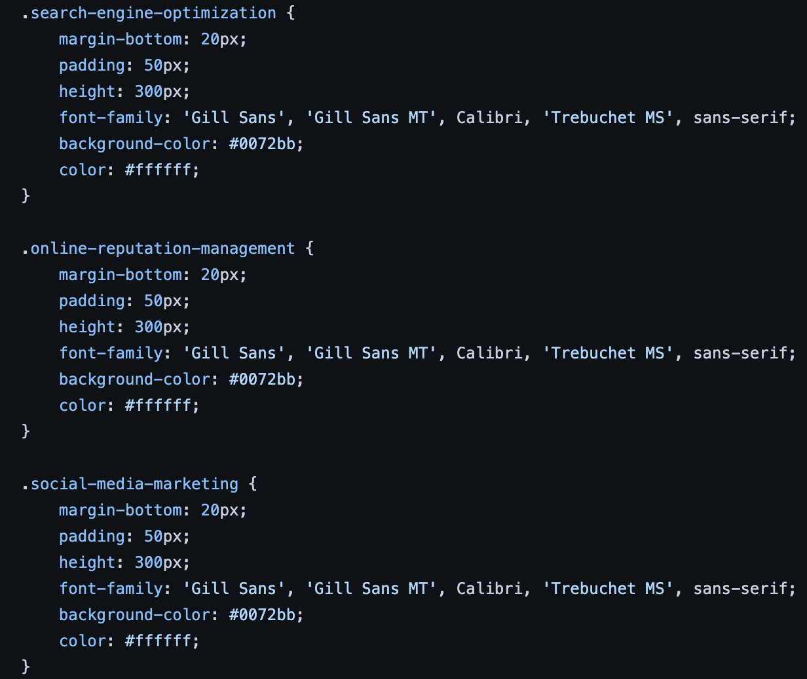 ---> 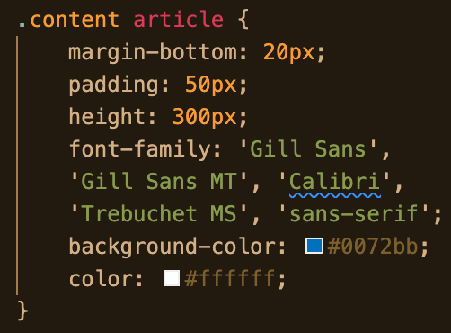
    

- deleted the following styles with classes and changed to .content img {}

&emsp;&emsp;&emsp;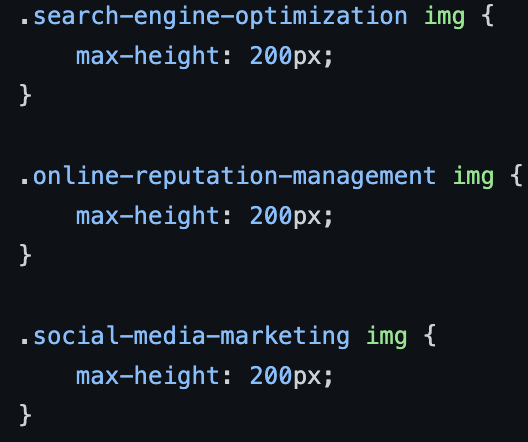 ---> 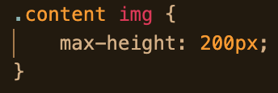

- deleted the following styles with classes and changed to .content h2 {}

&emsp;&emsp;&emsp;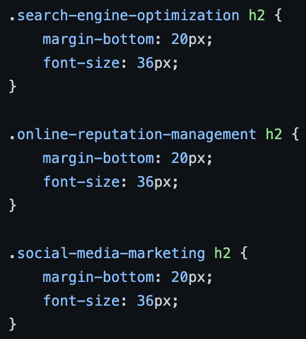 --->
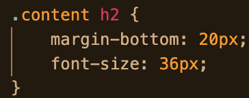

#### Benefits Styles
- moved font-family from .benefits {} to .benefits div {}
- .benefits div {}
    - font-family: changed Calibri and sans-serif to 'Calibri' and 'sans-serif'
        - added ' '
    - deleted the following styles with classes and changed to .benefits div {}

    

    &emsp;&emsp;&emsp;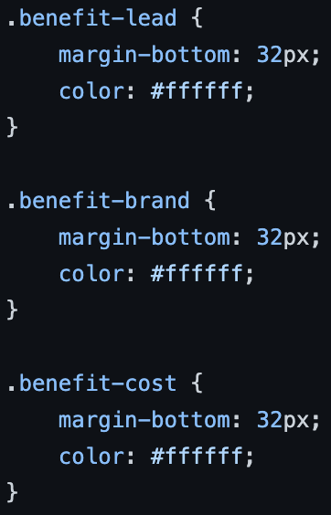  ---> 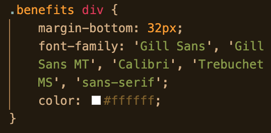
    

- deleted the following styles with classes and changed to .benefits div h3 {}

&emsp;&emsp;&emsp;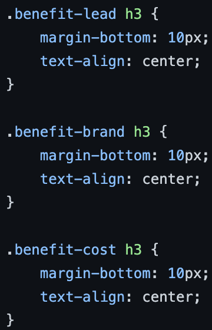 --->
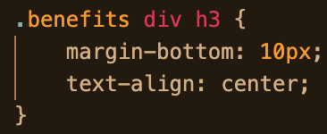

- deleted the following styles with classes and changed to .benefits div img {}

&emsp;&emsp;&emsp;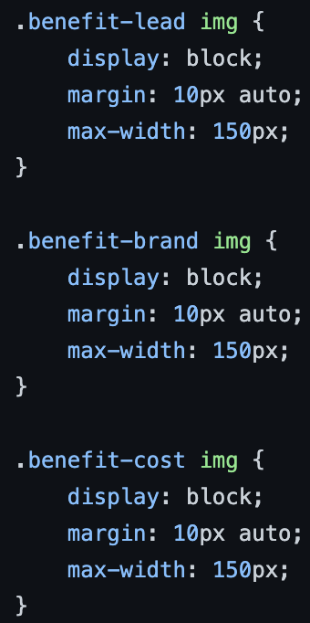 --->
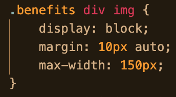

#### Footer Styles
- footer {}
    - changed .footer {} to footer {}
    - font-family: changed Arial and sans-serif to 'Arial' and 'sans-serif'
        - added ' '
- changed .footer h2 {} to footer h2 {}

## Credits
- Xandromous - [GitHub Profile](https://github.com/coding-boot-camp/urban-octo-telegram)
- Katherine Peterson - [readme.so](https://readme.so/)
- Kend Dodds - [badges](https://egghead.io/lessons/javascript-how-to-write-a-javascript-library-adding-badges-to-your-readme)
- [Shields.io](https://shields.io/)
- [Stack Overflow: <>](https://stackoverflow.com/questions/10413954/how-to-make-a-github-readme-page-display-html-code-as-is)
- [Stack Overflow: Images](https://stackoverflow.com/questions/12090472/how-do-i-center-an-image-in-the-readme-md-file-on-github/62383408#62383408)
- [Stack Overflow: Align](https://stackoverflow.com/questions/63120753/github-readme-md-align-images)
- [Stack Exchange: Multiple Spaces](https://meta.stackexchange.com/questions/122520/how-to-write-multiple-spaces-in-the-post)